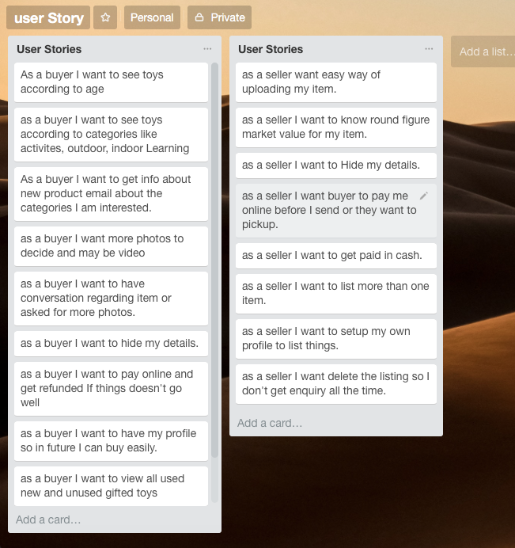
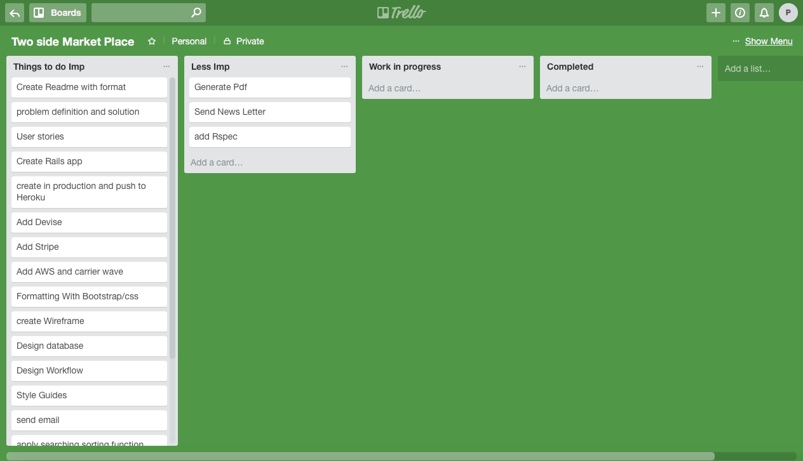

# The Book Place

Completed as Project in [Coder Academy's](https://coderacademy.edu.au/) Fast Track Bootcamp.

View live: https://toys-marketplace.herokuapp.com

**Table of Contents**
  * [Problem Definition and Solution](#problem-definition-and-solution)
    + [Problem](#problem)
      - [Why online?](#why-online-)
    
      - [What's wrong with the sites that already exist?](#what-s-wrong-with-the-sites-that-already-exist-)
    + [Solution](#solution)
  * [User Stories](#user-stories)
    + [Preliminary User Stories](#preliminary-user-stories)
    + [Detailed User Stories](#detailed-user-stories)
  * [Workflow](#workflow)
  * [Style Guide](#style-guide)
  * [Wireframes](#wireframes)
  * [ERD](#erd)
  * [Trello](#trello)
  * [Whats Future](#future)

## Problem Definition and Solution

### Problem

There is a need for a better online store focused on just selling Toys in Australia where buyer can shop for new, old or unused one.

- Why online?
- Why within Australia
- What's wrong with the sites that already exist?

#### Why online?
Online shopping cover wider market so there are more buyer and seller. It allows buyer to see photos/videos of a product so they save their time not being phsically there aswell as seller doesn't have go to different marketplace to sell their products.

#### What's wrong with the sites that already exist?
There are Website and store who sells toys online. Store who sell only sell brand they associated with and they are new products in high price. Website like ebay and gumtree sell various product and they don't care about any niche market.

### Solution

Create a better online store which are onl focused on toys which are new and brand associalted with. Here it can be new/old and unused one in one place .

## User Stories

User stories were collected in paper and Trello, with more detailed user stories subsequently created.

During the process it was found every user have different viewpoint of browsing website and everybody some stories were distinctive. During this process it also help us to think differently and make a better verion.

### Preliminary User Stories

### Detailed User Stories

***User should be able to edit their own profile***

**Feature:** Edit Profile

- As a User
- I want to edit/ delete  my profile

**Scenario:** User edits profile

- Given I'm a logged in User
- When I go to the edit profile page for my profile
- And I change the text in the text fields and/or upload a new profile photo
- And I click "Update profile"
- Then I should see my profile page
- And the details should be updated

---

***User should not be able to edit a profile that is not theirs***

**Feature:** Unable to edit other user's profile
- As a User
- I want nobody other than me to be able to edit my profile
- Because I want to have control over my profile details

**Scenario:** User attempts to edit another user's profile
- Given I'm a logged in User
- When I go to the edit profile page for another user's profile
- Then I am redirected back to the user's profile view page

---

***User should be able to edit a book listing that is theirs***

**Feature:** Edit Book Listing
- As a User
- I want to edit one of my book listings
- Because I want to improve the accuracy of my book listing

**Scenario:** User edits book listing
- Given I'm a logged in User
- When I go to the edit page for a book listing that is mine
- And I change the text in the text fields and/or upload a new book image
- And I click "Update book"
- Then I should see the detailed view page for that book
- And the details should be updated

---

***User should not be able to edit a book listing that is not theirs***

**Feature:** Unable to edit other user's book listing
- As a User
- I want nobody other than me to be able to edit my book listings
- Because I want to have control over my book listings

**Scenario:** User attempts to edit another user's book listing
- Given I'm a logged in User
- When I go to the edit book page for another user's book listing
- Then I am redirected back to the detailed view page for that book listing

---

***User should be able to delete a book listing that is theirs***

**Feature:** Delete Book Listing
- As a User
- I want to delete one of my book listings
- Because I have decided not to sell it

**Scenario:** User deletes book listing
- Given I'm a logged in User
- When I go to the edit page for a book listing that is mine
- And I click 'delete book'
- Then the book listing should be deleted from the database

---

***User should not be able to open a message conversation with themselves***

**Feature:** Unable to message self
- As a User
- I do not want to see an option to message myself
- Because this would be pointless functionality

**Scenario:** User visits messages page
- Given I'm a logged in User
- When I go to the messages page
- Then my username is not listed as an option to message

---

***User should not see a 'message reader' button on their own profile***

**Feature:** No 'message reader' button on own profile
- As a User
- I do not want to see an option to message myself
- Because this would be pointless functionality

**Scenario:** User visits their profile page
- Given I'm a logged in User
- When I go to my profile page
- Then I do not see a 'message reader' button

---

***User should be able to view book listings on homepage without logging in***

**Feature:** Homepage viewable without login
- As a User
- I want to view book listings without signing in
- Because I want to know it's worth signing up before I do so

**Scenario:** User visits homepage
- Given I'm a logged out user
- When I go to the homepage
- Then I can view the book listings

---

***User should be able to view detailed book listing without logging in***

**Feature:** Detailed book view viewable without login
- As a User
- I want to view book listings without signing in
- Because I want to know it's worth signing up before I do so

**Scenario:** User visits detailed book view page
- Given I'm a logged out user
- When I go to the detailed book view page
- Then I can view the detailed book view page

---

***User should not be able to view Messages page without logging in***

**Feature:** User must be logged in to view messages page
- As a User
- I want to know that only users who are logged in can message me
- Because I don't want to get spammed

**Scenario:** User visits messages page
- Given I'm a logged out user
- When I go to the messages page
- Then I am redirected to the login page

---

***User should not be able to view New Book form page without logging in***

**Feature:** User must be logged in to see the add new book form
- As site Admin
- I want users to be required to log in in order to add a book listing
- Because I want to encourage users to create an account on the site

**Scenario:** User visits add new book page
- Given I'm a logged out user
- When I go to the add new book page
- Then I am redirected to the login page

---

***When logged in, user should not be able to view any page other than 'create profile' until they have created a profile***

**Feature:** User must create a profile upon signup in order to interact on the site
- As site Admin
- I want all users to be required to have a profile
- Because it builds a sense of community

**Scenario:** User without a profile attempts to visit any page
- Given I'm a logged in user
- And I don't have a profile
- When I go to any page other than the create profile page
- Then I am redirected to the create profile page

## Workflow

The original workflow was conceptualised in the diagram below. Some minor alterations were made during development as needed. These will be reflected in a future version of this diagram.

## Style Guide

Colours and fonts were chosen as below.

Color were choosed to make more simple to make more kids and family friendly and keeping in the mind for the visibility purpose.

Google fonts were choose to make website looks better and the fonts which are easier to use and looks attractive at the same time.

Open Sans was designed with an upright stress, open forms and a neutral, yet friendly appearance. It was optimised for print, web, and mobile interfaces, and has excellent legibility characteristics in its letterforms.

## Wireframes

Wire Fraim was made using figma https://www.figma.com/file/BeAjfu1eRpS27Gpdzis3sRPQ/Untitled

## ERD

It s belongs to and Has many relationship diagram

Erd designe in Db Designer 
View https://www.dbdesigner.net/designer

## Trello

Trello was used for project management and to track the workflow and things were done according to their importance.

See this project's [Trello board]https://trello.com/b/cBeUpozq/two-side-market-place?menu=filter&filter=label:yellow,label:nonefor details.

Images of different faces of project

## future

This is now as a beta and a testing version which will have many more future for buyers and sellers and more secure. Users can design the page they like as their own store. There will be association with courrier company which will seller for cheaper and reliable delivery at the same time user will also benefit from it. This site will be soley focused related to kids.